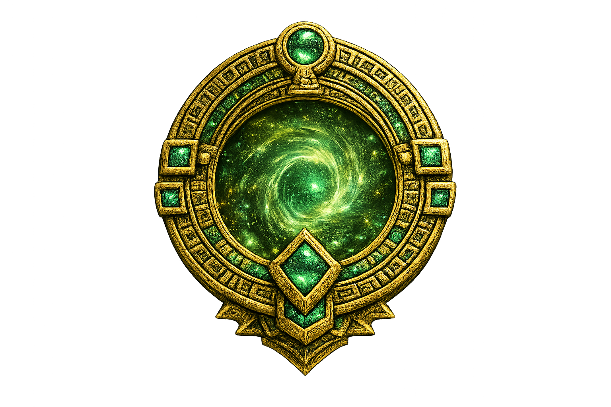

# Expedition Vault — финальные исправления интерфейса и квестов

## 1. Общая цель

Необходимо внести пять связанных изменений:

1. каждый экран каждого квеста полностью помещается в viewport без вертикальной прокрутки;
2. в финале Hidden Trail используется изображение портала `3.png`;
3. тропы Hidden Trail выглядят как старые каменные дороги, поросшие лианами;
4. после прохождения всех трех квестов на главной странице появляется кнопка выхода, открывающая `video1.mp4`;
5. игрок может самостоятельно изменить имя в профиле.

Все тексты интерфейса остаются на английском языке.

## 2. Квесты должны помещаться на один экран

### 2.1. Основное правило

Каждая отдельная сцена Lost Temple, Jungle Code и Hidden Trail должна целиком помещаться в доступную область браузера.

Игрок не должен прокручивать страницу, чтобы:

- увидеть вопрос;
- выбрать вариант;
- взаимодействовать с колесом или паззлом;
- найти кнопку подтверждения;
- увидеть прогресс;
- перейти к следующему этапу;
- закончить квест.

Для игровых страниц использовать:

```css
html,
body {
  width: 100%;
  height: 100%;
  overflow: hidden;
}

.quest-page {
  width: 100vw;
  min-height: 100vh;
  height: 100dvh;
  overflow: hidden;
}
```

Предпочитать `100dvh`, чтобы мобильная адресная строка не обрезала нижнюю часть интерфейса.

### 2.2. Расчет доступной высоты

Если шапка имеет фиксированную высоту:

```css
.quest-content {
  height: calc(100dvh - var(--quest-header-height));
  min-height: 0;
}
```

Внутренние grid- и flex-контейнеры обязательно получают `min-height: 0`, иначе содержимое может растянуть родителя и создать скрытый скролл.

### 2.3. Адаптивное масштабирование

Использовать `clamp()` для:

- заголовков;
- отступов;
- игровых объектов;
- кнопок;
- картинок;
- расстояний между панелями.

Пример:

```css
.quest-title {
  font-size: clamp(28px, 5vh, 64px);
}

.quest-panel {
  padding: clamp(10px, 2.2vh, 28px);
  gap: clamp(8px, 1.5vh, 20px);
}
```

### 2.4. Контроль низких экранов

Добавить отдельные media queries по высоте:

```css
@media (max-height: 800px) { /* compact layout */ }
@media (max-height: 680px) { /* extra compact layout */ }
```

На низких экранах разрешается:

- уменьшить декоративные отступы;
- немного уменьшить заголовок;
- сократить декоративные подписи;
- уменьшить колесо, изваяние, паззл или портал;
- расположить блоки в две колонки;
- скрыть только неинтерактивные украшения.

Нельзя скрывать вопрос, прогресс, игровые элементы, обратную связь или основные кнопки.

### 2.5. Lost Temple

Все сцены Lost Temple должны помещаться без прокрутки:

- старт;
- выбор сложности;
- языковые задания;
- двери храма;
- сбор фрагментов;
- паззл реликвии;
- восстановленная реликвия.

Для зала с реликвией ограничить игровую область:

```css
.relic-chamber {
  height: min(68dvh, 680px);
}
```

Фрагменты, силуэт и кнопка возврата должны одновременно оставаться видимыми.

### 2.6. Jungle Code

Одновременно должны быть видны:

- номер сообщения;
- зашифрованная фраза;
- поле ответа;
- оба кольца;
- экранная клавиатура;
- подсказка;
- кнопка **LOCK ALIGNMENT** или **CHECK MESSAGE**;
- счетчик рун.

На низких экранах располагать колесо и поле ответа в две колонки. После фиксации разрешается немного уменьшить колесо, чтобы экранная клавиатура не выходила за viewport.

Финальный зал с рунами также должен полностью помещаться в один экран.

### 2.7. Hidden Trail

Одновременно должны быть видны:

- текущий этап;
- пять маркеров прогресса;
- языковая подсказка;
- все доступные дороги;
- сообщение о результате;
- кнопка продолжения, когда она необходима.

Высота дорог должна вычисляться относительно viewport, а не задаваться постоянной большой величиной.

## 3. Портал Hidden Trail

### 3.1. Используемый ассет

В финальной сцене Hidden Trail использовать реальное изображение:

```text
3.png
```

Не заменять его CSS-овалом, градиентом, эмодзи или условным символом.

### 3.2. Отображение

```html

```

```css
.hidden-trail-portal {
  display: block;
  width: auto;
  height: min(55dvh, 560px);
  max-width: min(80vw, 760px);
  object-fit: contain;
}
```

Сохранять исходные пропорции изображения.

### 3.3. Активация портала

После прохождения пятого этапа:

1. туман рассеивается;
2. изображение `3.png` плавно появляется;
3. портал получает мягкое золото-зеленое свечение;
4. показывается **THE HIDDEN TRAIL HAS BEEN REVEALED**;
5. появляется кнопка **ENTER THE PORTAL**.

Анимация не должна искажать само изображение.

## 4. Каменные дороги Hidden Trail

### 4.1. Внешний вид

Каждый вариант ответа должен выглядеть как отдельная старая дорога:

- неровные каменные плиты;
- трещины и сколы;
- земля между камнями;
- мох на краях;
- лианы, пересекающие отдельные плиты;
- корни, уходящие в землю;
- разная форма левой, центральной и правой дороги;
- темная лесная перспектива.

Дороги не должны выглядеть как плоские треугольные кнопки.

### 4.2. Структура

```html
<button class="trail-road trail-road--left">
  <span class="trail-road__sign">set off</span>
  <span class="trail-road__stones" aria-hidden="true"></span>
  <span class="trail-road__vines" aria-hidden="true"></span>
</button>
```

Текст ответа размещается:

- на старом деревянном указателе;
- на покрытой мхом каменной плите;
- на древней табличке рядом с дорогой.

### 4.3. Каменная текстура

Камни можно создавать сочетанием:

- нескольких CSS-слоев;
- `repeating-linear-gradient`;
- `radial-gradient`;
- псевдоэлементов;
- `clip-path` для неровного силуэта;
- теней между плитами.

Если в проект позже добавится текстура дороги, архитектура должна позволять заменить CSS-фон изображением без изменения логики.

### 4.4. Лианы

Лианы являются декоративными слоями с `pointer-events: none`.

Они не должны:

- закрывать надпись;
- мешать нажатию;
- ухудшать читаемость;
- выходить за пределы игрового экрана.

### 4.5. Состояния дороги

Обычная дорога:

- темный серо-зеленый камень;
- слабая золотистая подсветка надписи при наведении.

Правильная дорога:

- туман отступает;
- между плитами появляется сдержанное зелено-золотое свечение;
- камера движется вперед.

Неправильная дорога:

- камни темнеют;
- лианы становятся почти невидимыми;
- туман заполняет дорогу от дальнего края к игроку;
- дорога блокируется.

Не использовать яркий неоновый зеленый цвет.

## 5. Финальная кнопка выхода

### 5.1. Условие появления

Кнопка появляется на главной странице только тогда, когда успешно завершены все три квеста:

```js
const allQuestsCompleted =
  localStorage.getItem('lostTempleCompleted') === 'true' &&
  localStorage.getItem('jungleCodeCompleted') === 'true' &&
  localStorage.getItem('hiddenTrailCompleted') === 'true';
```

Дополнительно можно сверять список `expeditionAchievements`, но основным условием остаются три ключа завершения.

До выполнения условия кнопка полностью скрыта и недоступна с клавиатуры.

### 5.2. Текст кнопки

Рекомендуемый текст:

> **LEAVE THE JUNGLE**

Подпись:

> **All three trials are complete. The final gate is open.**

Кнопку разместить в hero-секции главной страницы рядом с прогрессом или под основным текстом.

### 5.3. Окно с финальным видео

При нажатии открывать полноэкранное модальное окно поверх главной страницы.

Внутри использовать:

```text
video1.mp4
```

```html
<video controls playsinline preload="metadata">
  <source src="video1.mp4" type="video/mp4">
</video>
```

Требования:

- окно занимает весь экран;
- фон за окном затемняется;
- видео сохраняет пропорции через `object-fit: contain`;
- видео не обрезается;
- после пользовательского клика разрешается автоматически начать воспроизведение;
- присутствует заметная кнопка **CLOSE**;
- поддерживается закрытие клавишей `Escape`;
- при закрытии видео ставится на паузу и возвращается в начало;
- фокус клавиатуры не уходит под открытое окно;
- музыка главной страницы или квеста не должна одновременно играть с видео.

После сброса прогресса кнопка **LEAVE THE JUNGLE** снова скрывается.

## 6. Редактируемое имя игрока

### 6.1. Размещение

В профиле вместо жестко заданного имени `Explorer` показывать сохраненное имя игрока.

В раскрывающемся меню добавить действие:

> **EDIT PLAYER NAME**

### 6.2. Редактирование

По нажатию открыть небольшую форму:

```html
<form class="player-name-form">
  <label for="player-name-input">Explorer name</label>
  <input id="player-name-input" maxlength="24" autocomplete="nickname">
  <button type="submit">SAVE NAME</button>
</form>
```

После сохранения обновить:

- имя в шапке;
- первую букву аватара;
- доступные обращения к игроку на главной странице.

### 6.3. Валидация

- удалить пробелы в начале и конце;
- длина — от 1 до 24 символов;
- разрешить латинские и кириллические буквы, цифры, пробел, дефис и апостроф;
- не сохранять строку, состоящую только из пробелов;
- экранировать пользовательское значение и выводить через `textContent`;
- если поле пустое, сохранить прежнее имя;
- стартовое имя — `Explorer`.

### 6.4. Сохранение

```js
localStorage.setItem('expeditionPlayerName', playerName);
```

При загрузке:

```js
const playerName =
  localStorage.getItem('expeditionPlayerName') || 'Explorer';
```

Сброс прогресса квестов не должен удалять имя игрока. Для удаления имени нужна отдельная команда или ручная замена через профиль.

### 6.5. Доступность

- поле имеет `label`;
- `Enter` сохраняет имя;
- `Escape` закрывает форму без сохранения;
- после открытия фокус переходит в поле;
- после сохранения фокус возвращается на кнопку профиля;
- ошибки отображаются текстом, а не только цветом.

## 7. Необходимые ключи localStorage

```text
lostTempleCompleted
jungleCodeCompleted
hiddenTrailCompleted
expeditionAchievements
expeditionPlayerName
```

Имя не относится к прогрессу и не удаляется кнопкой **Reset progress**.

## 8. Критерии готовности

### Квесты

- [ ] Все сцены Lost Temple помещаются в viewport без прокрутки.
- [ ] Все сцены Jungle Code помещаются в viewport без прокрутки.
- [ ] Все сцены Hidden Trail помещаются в viewport без прокрутки.
- [ ] Основные кнопки всегда видны.
- [ ] Интерфейс работает на широких, узких и низких экранах.
- [ ] На мобильных устройствах учитывается `100dvh`.

### Hidden Trail

- [ ] Финальный портал использует `3.png`.
- [ ] Изображение портала не искажается и не обрезается.
- [ ] Дороги выглядят как старые каменные тропы.
- [ ] На дорогах видны мох, корни и лианы.
- [ ] Текст задания остается читаемым.
- [ ] Неправильную дорогу постепенно поглощает туман.
- [ ] Правильная дорога получает сдержанную подсветку.

### Финальный выход

- [ ] Кнопка скрыта, пока не пройдены все три квеста.
- [ ] После трех завершений появляется **LEAVE THE JUNGLE**.
- [ ] Кнопка открывает полноэкранное окно с `video1.mp4`.
- [ ] Видео можно закрыть кнопкой и клавишей `Escape`.
- [ ] При закрытии воспроизведение полностью останавливается.
- [ ] После сброса прогресса кнопка снова скрывается.

### Профиль

- [ ] Игрок может открыть форму изменения имени.
- [ ] Имя сохраняется в `localStorage`.
- [ ] Имя восстанавливается после перезагрузки.
- [ ] Аватар показывает первую букву имени.
- [ ] Некорректное или пустое имя не сохраняется.
- [ ] Reset progress не удаляет имя.
